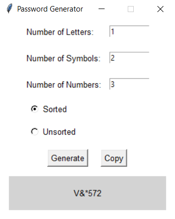

# Password Generator

A simple and interactive password generator built using Python and Tkinter. This application allows users to generate secure passwords with a mix of letters, numbers, and symbols. Users can customize the composition of their password and copy it to the clipboard with a single click.

  

## Features

- **Customizable Password Composition**: Specify the number of letters, numbers, and symbols.
- **Sorted or Unsorted Passwords**: Choose between generating passwords in a sorted (grouped by type) or unsorted (shuffled) manner.
- **Copy to Clipboard**: Quickly copy the generated password to your clipboard.
- **User-Friendly Interface**: Simple and intuitive graphical interface built with Tkinter.

## Installation

1. **Clone the Repository**.
2. **Install Python**: Ensure Python 3.x is installed on your system. You can download it from python.org.
3. **Run the Application**: 
To run the application directly:

### Option 1: Python Method (for developers)
Run the main.py file to start the application:

    python main.py

### Option 2: Executable (for immediate use)
There are precompiled executable files available for quick use:

* Windows: pw.exe located in the bin folder.
* Linux: pg.sh located in the bin folder.
To run these:

On Windows, double-click the pw.exe file to execute the program.
On Linux, run the pg.sh shell script:

    sudo chmod +x bin/pg.sh
    ./bin/pg.sh

## Usage
1. Enter the desired number of letters, symbols, and numbers for your password.
2. Choose between:

* *Sorted*: Grouped by type (letters, numbers, symbols).
* *Unsorted*: Randomly shuffled.

3. Click Generate to create the password.
4. The password is generated in the result box.
5. Click Copy to copy the password to your clipboard.

## Contributing
This project is open-source so feel free to fork this project and submit pull requests for improvements or new features. Suggestions or enhancements are always welcome!